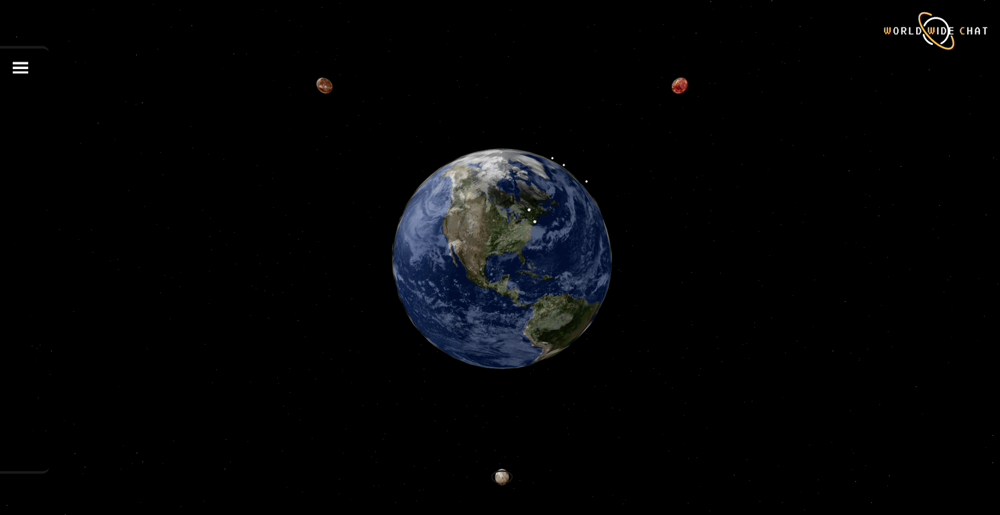
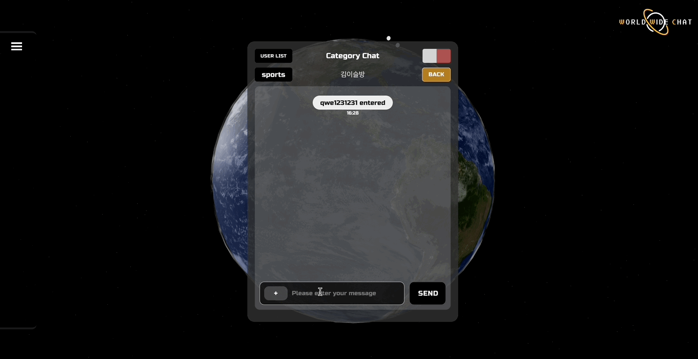
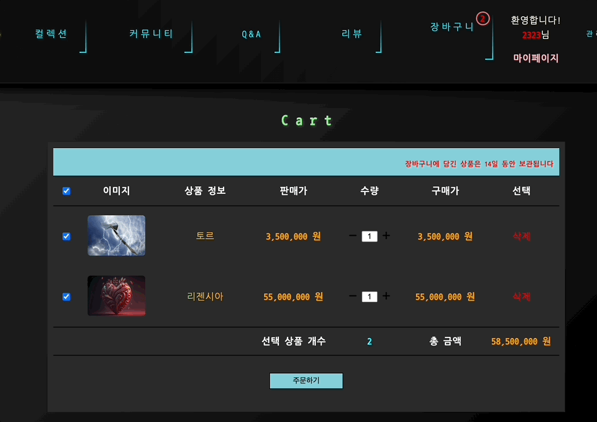

---
layout: archive-taxonomies
type: categories
title: Projects
permalink: /projects/
---   

 

  <ul class="taxonomies">
    <li><a class="taxonomy" href="#wwc">
      WWC
      chatting platform
    </a></li>
    <li><a class="taxonomy" href="#potion">
      Potion Shop
      shopping mall
    </a></li>
  </ul>

  <h2 class = "center-text" id="wwc">WWC</h2>  
  
전 세계 어디서든, 언어의 장벽 없이, 누구와도 대화가 가능한, 새로운 채팅 플랫폼

  
(2023.07 ~ 2023.09 개발 중)

 
[`github 바로가기`](https://github.com/bonugg/WorldChatProject)    
  
{: width="650px" height="400px"}   

&#128071; my role &#128071;
 

- 이것이 다운로드다
- 이것이 다운로드다

{: width="650px" height="400px"}  

관심사 채팅(category chat)
  

- 이것이 다운로드다
- 이것이 다운로드다

{: width="650px" height="400px"} 

실시간 메시지 전송 & 자동 번역

- 이것이 다운로드다
- 이것이 다운로드다

{: width="650px" height="400px"} 

파일 전송 & 다운로드

- 이것이 다운로드다
- 이것이 다운로드다

<h2 class = "center-text" id="potion">Potion Shop</h2>

초능력을 판매하는 포션 쇼핑몰 '포션이었다'

(2023.06 ~ 2023.07 개발 완료)

[`github 바로가기`](https://github.com/three-team1/main/tree/main)    
    
{: width="650px" height="400px"} 

&#128071; my role &#128071;
  

{: width="650px" height="400px"}   

QNA 게시판

- CRUD 기능 구현 
- CRUD 기능 구현 

{: width="650px" height="400px"} 

장바구니

- CRUD 기능 구현 
- CRUD 기능 구현 

{: width="650px" height="400px"} 

결제페이지

- CRUD 기능 구현 
- CRUD 기능 구현 

{: width="650px" height="400px"} 

결제
   

- CRUD 기능 구현 
- CRUD 기능 구현 
  