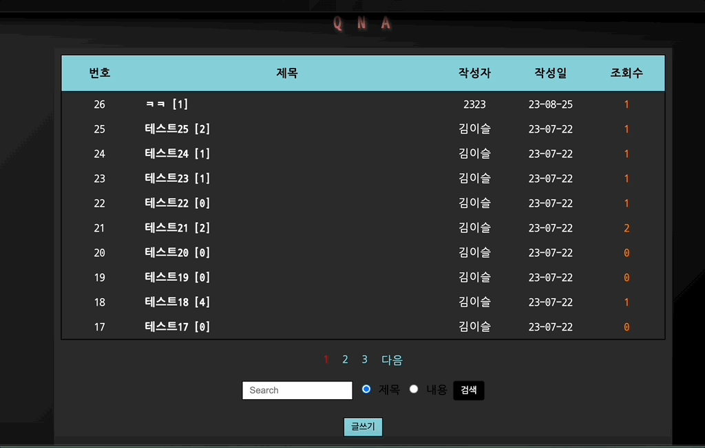

---
layout: archive-taxonomies
type: categories
title: Projects
permalink: /projects/
---  
 

  <ul class="taxonomiess"><li><a class="taxonomy" href="#wwc">
              WWC
              chatting platform
            </a>
          </li><li><a class="taxonomy" href="#potion">
              Potion Shop
              shopping mall
            </a>
          </li></ul>

<h2 id="wwc">wwc</h2>
      <ul class="post-list-by-taxonomy">
          <li>
          </li>
      </ul>

 
 
        

<h2 id="potion">potion</h2>
      <ul class="post-list-by-taxonomy">
          <li>
            
        [`github 바로가기`](https://github.com/three-team1/main/tree/main) 
        - 초능력을 판매하는 쇼핑몰 '포션이었다' (2023.06 ~ 2023.07)
    </li>
    <li>
        {: width="650px" height="400px"}
        - qna게시판
    </li>
    <li>
        {: width="650px" height="400px"} 
        - 장바구니 & 결제페이지
    </li>
    <li>
        {: width="650px" height="400px"} 
        - 결제
    </li>
      </ul>
      <a href="#" onclick="backToTop()" class="back-to-top">Top &#8648;</a>

{: width="650px" height="400px"}  
[`github 바로가기`](https://github.com/three-team1/main/tree/main) 
- 초능력을 판매하는 쇼핑몰 '포션이었다' (2023.06 ~ 2023.07)
{: width="650px" height="400px"}
- qna게시판
{: width="650px" height="400px"} 
- 장바구니 & 결제페이지
{: width="650px" height="400px"} 
- 결제
