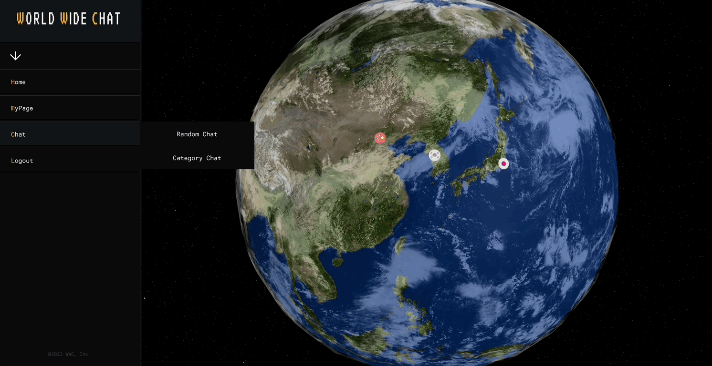
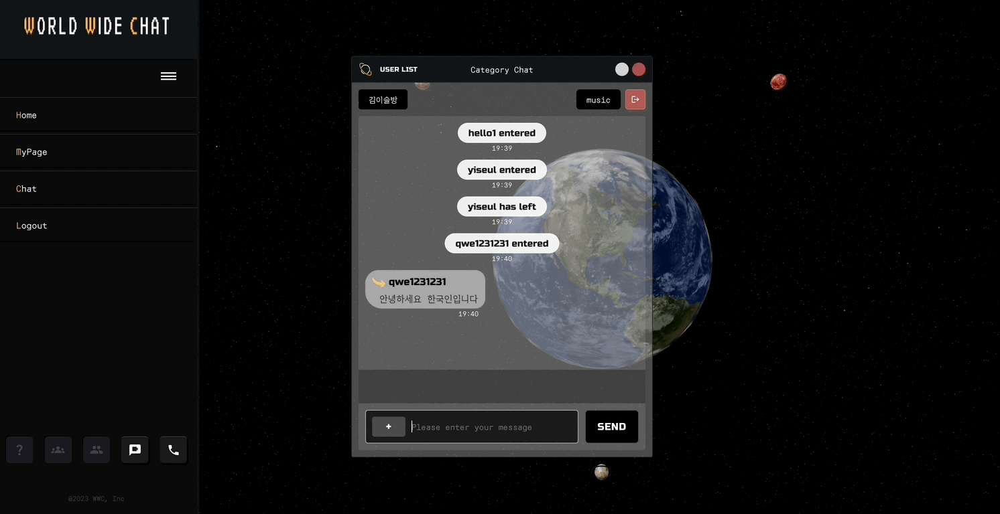
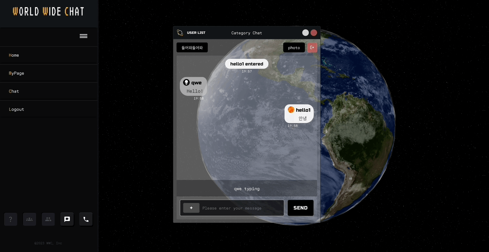
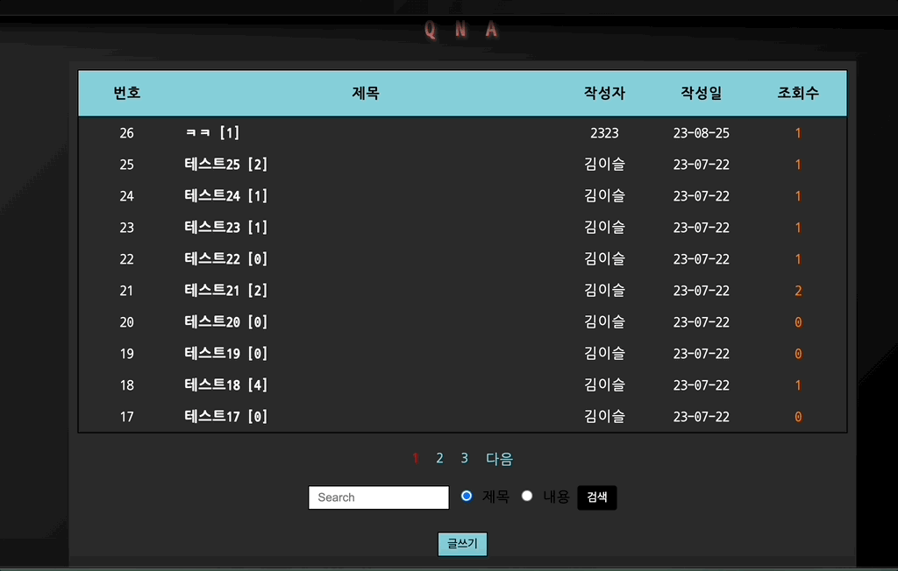
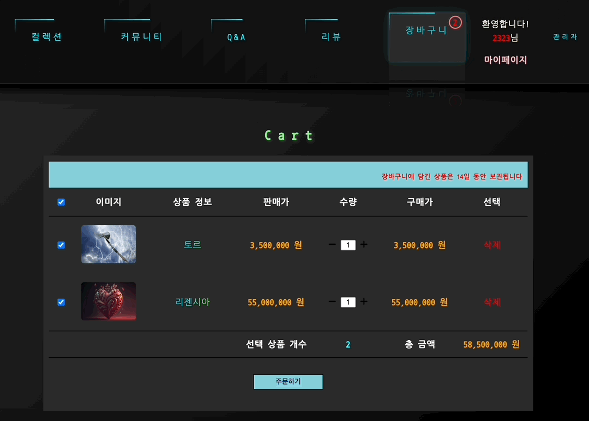
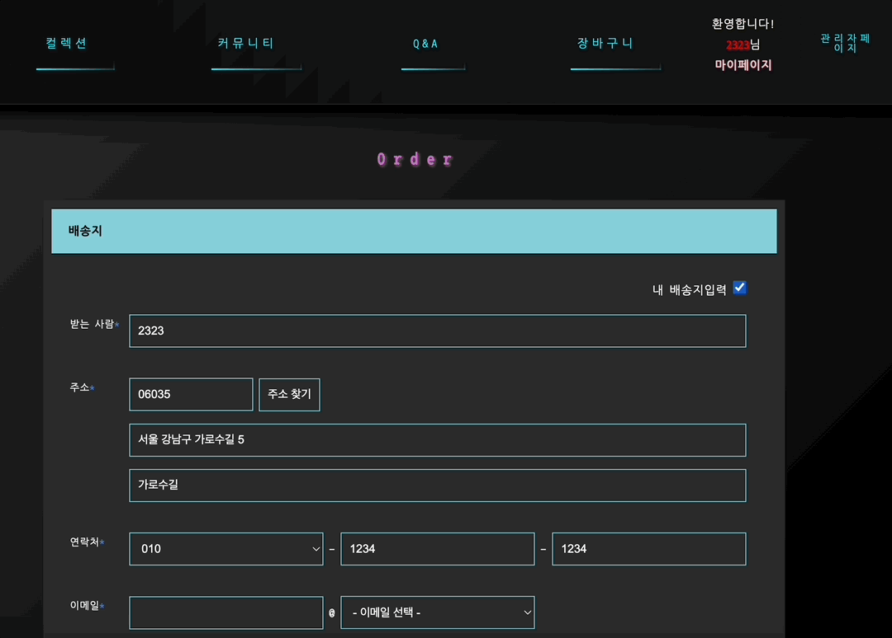

---
layout: archive-taxonomies
type: categories
title: Projects
permalink: /projects/
---   

  <ul>
  <li><a href="#shelter">
      Shelter Peace
      location-based shelter notification
    </a></li>
  </ul>

 <ul class="taxonomies">
    <li><a class="taxonomy" href="#wwc">
      WWC
      chatting platform
    </a></li>
    <li><a class="taxonomy" href="#potion">
      Potion Shop
      shopping mall
    </a></li>
  </ul>

  <h2 class = "center-text" id="shelter">Shelter Peace</h2>  
  
실시간 위치 기반 재난 대피소 알림 어플

  
(2023.10 ~ 개발 중)

[`github 바로가기`](https://github.com/ShelterPeace/Peace_BackEnd)  
 

  <h2 class = "center-text" id="wwc">WWC</h2>  
  
언어의 장벽 없이, 전 세계 누구와도 채팅이 가능한 새로운 플랫폼

  
(2023.07 ~ 2023.09)

 
[`github 바로가기`](https://github.com/bonugg/WorldChatProject)  
[`notion 바로가기`](https://eseulssi.notion.site/WWC-worldwide-chat-8b3d1599f3ec40fa95bb730569adb5ab?pvs=4) 
  
{: width="730px" height="400px"}   

&#128071; my role &#128071;
 

{: width="730px" height="400px"}  

&#128204; 단체 관심사 채팅(category chat)
   

- 총 열 세 개의 카테고리 별 채팅방 분류
- 방 이름, 최대 인원수, 카테고리 입력 후 채팅방 개설 가능
- 채팅방을 개설한 유저(방장)는 채팅방 자동 입장

{: width="730px" height="400px"} 

&#128204; 실시간 메시지 전송

- 웹소켓을 이용한 실시간 메시지 전송 가능
- 입장/퇴장 시 '입장/퇴장 메시지' 표출
- 채팅창 입력 시 'typing...' 메시지 표출 -> 입력이 끝나면 채팅 내용 전송
- 채팅에 참여 중인 유저리스트 표출
- 유저리스트가 '0'이 될 경우, 채팅방 자동 삭제

{: width="730px" height="400px"} 

&#128204; 자동 번역

- 번역 언어 설정 시, 상대 유저의 언어를 자동으로 감지하여 내가 설정한 언어로 '자동 번역'
- 여러 언어가 오가는 단체 채팅 특성 상, 자동 번역 기능이 유용할 것으로 예상
- Papago Translation API / Papago Detection API 사용

{: width="730px" height="400px"} 

&#128204; 파일 전송 & 다운로드

- 웹소켓을 이용한 실시간 사진, 동영상, 문서 파일 등 여러 종류의 파일 전송 가능
- 전송한 파일은 ncloud의 object storage에 저장
- DB에는 데이터 정보를 저장
- 버튼을 이용해 파일 다운로드 가능

 

&#128221; 프로젝트를 진행하며 느낀 점

- 프론트엔드와 백엔드로 나눠 작업하면서 백엔드 개발에만 집중할 수 있었지만, 초기에는 표출 값을 Postman을 통해 확인하는 작업이 생소했습니다. 그러나 React를 사용하는 프론트엔드와의 첫 협업이었기 때문에 코드 전달과 소통 방식을 어떻게 해야 서로가 편하게 협력할 수 있는지를 배우는 시간이었습니다.
- 가장 큰 과제는 Node.js 대신 'Spring Boot'를 사용하여 WebSocket을 구현하는 것이었습니다. 레퍼런스 자료가 제한적이어서 특히 어려웠습니다. WebSocket의 기본 원리를 이해하려 노력하며 코드를 작성해 나갔고, 실시간 로직을 많은 기능에 적용했을 때의 이점을 이해하게 되었습니다.
- 처음으로 ncloud의 object storage를 사용하여 파일 전송과 다운로드를 구현하였습니다. DB에 데이터를 저장하는 것 외에도 저장소 시스템에 대해 이해할 수 있었습니다.

  

<h2 class = "center-text" id="potion">Potion Shop</h2>

초능력을 판매하는 포션 쇼핑몰 '포션이었다'

(2023.06 ~ 2023.07)

[`github 바로가기`](https://github.com/three-team1/main/tree/main) 
[`notion 바로가기`](https://eseulssi.notion.site/Potion-Shop-e167e0bc5d1742d8827ae734eee06ee7?pvs=4) 
    
{: width="730px" height="400px"} 

&#128071; my role &#128071;
  

{: width="730px" height="400px"}   

&#128204; QNA 게시판

- CRUD 기능 구현
- 게시글 제목과 해당 게시글의 댓글 갯수를 같이 표출
- 댓글 작성 및 삭제 가능
- 새로고침 시 조회수 상승 방지 기능
- 제목과 내용으로 게시글 검색 가능 

{: width="730px" height="400px"} 

&#128204; 장바구니

- 전체 주문 / 선택 주문에 따른 상품 개수와 총 금액 표출
- +, -으로 수량 조절
- 수량에 따른 금액 상승 / 감소
- 장바구니 물품 삭제 가능
- 주문하기 버튼 클릭 시 결제페이지로 이동

{: width="730px" height="400px"} 

&#128204; 결제페이지

- 내 배송지 입력 버튼 클릭 시 회원가입 시 입력한 회원 정보를 자동으로 불러옴
- 배송지 정보 직접 입력 가능
- 이전 장바구니 페이지에서 주문한 상품과 수량, 금액 표시
- 카드 결제 가능
- 결제하기 버튼을 누르면 결제창으로 이동(아임포트 api - NHN KCP 사용)

 

&#128221; 프로젝트를 진행하며 느낀 점

- 프로젝트를 기능별로 나눠 작업했기 때문에 HTML, CSS, Javascript, Spring Boot 등을 골고루 사용해야 했습니다. 특히 첫 프로젝트였기 때문에 컨벤션과 규칙을 정하는 데 일부 부족한 부분이 있었습니다. 팀원들과 함께 협업하며 코드 작성 스타일, 네이밍 규칙, 디자인 패턴 등을 정하는 것에 대한 이해와 합의가 필요했습니다.
- 여러 기능이 게시판의 CRUD 기능에서 파생된다는 것을 알게 되었습니다. 게시판의 CRUD 기능을 기반으로 다른 기능을 개발하면 코드를 재사용할 수 있으며, 유지보수가 더 효율적으로 이루어질 수 있다는 것을 깨달았습니다. 
- 오류를 해결하는 과정에서 많은 것을 배울 수 있었습니다. 콘솔 창을 보는 방법과 동일한 오류에 대한 레퍼런스를 찾아보는 방법 또한 익힐 수 있었습니다.

 
 

  