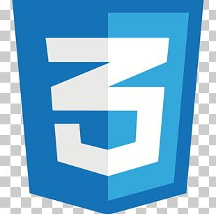

|  HTML |   JavaScript |  Java |   CSS | 
|  jQuery |   Thymeleaf|   JPA |   MyBatis |
|   SpringBoot |   SpringFramework |   Spring Security |  websocket |
|   Oracle |   MySQL |   Naver Cloud |  Apache 
|   Intellij|   VS Code |   Gradle |   Git  

<body>
<section class="colorlib-skills" data-section="skills">
    

            

                

                    <h3><strong>Java</strong></h3>
                    

                        

                        80%
                        

                    

                    자바의 기초를 공부하고 자료구조와 알고리즘을 자바기반으로 학습했습니다. 순수 자바를 활용 TDD 개발방법을 적용하여 객체 지향적인 코드개발 능력을 훈련하고 있습니다.
                

            

            

                

                    <h3><strong>SpringBoot</strong></h3>
                    

                        

                        80%
                        

                    

                    Spring으로 REST API를 활용하여 웹 서비스를 개발하였습니다. 스프링 데이터 JPA를 활용하고 스프링 Security Oauth2를 사용해서 구글, 네이버 자동로그인을 구현했습니다.
                

            

            

                

                    <h3><strong>WebSocket</strong></h3>
                    

                        

                        80%
                        

                    

                    부트스트랩을 활용해서 만든 뒤 자세한 설정은 CSS로 조절할 수 있도록 훈련했습니다. 모바일에서는 조금 부족하여 완성도 높은 서비스를 위해 기본적인 반응형에 대해 공부하고 있습니다.
                

            

            

                

                    <h3><strong>HTML / CSS</strong></h3>
                    

                        

                        70%
                        

                    

                    HTML 페이지를 설계하고 Thymeleaf, Mustache 템플릿 문법을 이용해서 데이터를 원하는 위치에 넣을 수 있습니다.
                

            

            

                

                    <h3><strong>Javascript</strong></h3>
                    

                        

                        50%
                        

                    

                    JavaScript, JQuery를 활용해서 몇가지 이벤트를 만들 수 있고 Ajax를 활용해서 서버와 비동기 통신하여 데이터를 분할하여 읽어오는 방법을 구현했습니다.
                

            

            

                

                    <h3><strong>GitHub</strong></h3>
                    

                        

                        90%
                        

                    

                    GitHub를 활용해서 프로젝트를 관리하고 커밋을 세분화하는 훈련을 했습니다. GitHub를 사용해서 알고리즘 문제를 풀이한 내용도 저장하고 있습니다.
                

            

            

                

                    <h3><strong>Naver Cloud</strong></h3>
                    

                        

                            50%
                        

                    

                    아마존 AWS를 활용해서 웹 서비스를 배포하는 경험이 있습니다.RDS(MariaDB)를 사용하고 있고 현재도 배포하며 업데이트 하고있습니다.
                

            

            

                

                    <h3><strong>MySQL</strong></h3>
                    

                        

                            50%
                        

                    

                    MySQL의 기본 쿼리문을 활용하여 데이터베이스와 대화할 수 있습니다. 대부분의 프로젝트에서 MySQL을 사용해봤고
                    배포중인 프로젝트에는 MariaDB를 사용하고 있습니다.
                

            

    
 
</section>

